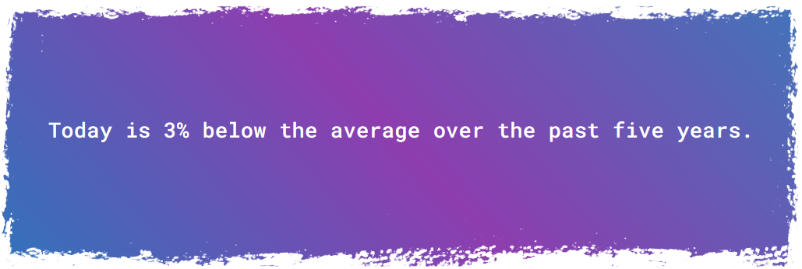

# Tempercent
  

_Expressing the temperature as a percentage to prevent "Oh, you think **that's** hot?"_

## About

A script that uses APIs ([Open-Meteo](https://open-meteo.com), [Postcodes.io](https://postcodes.io/)) to calculate today's temperature as a percentage of the average over the past five years for this date. Served as a web app with [Flask](https://flask.palletsprojects.com/en/2.3.x/).

## Usage

First, install [Poetry](https://python-poetry.org/). Then clone the repository, install dependencies with `poetry install` in the root directory, then `poetry run python tempercent_app/app.py` to start the Flask server.

## To Do:

- [x] type hints
- [x] requirements.txt
- [x] error handling for external calls
- [x] postcode validation via uk-postcode-utils
- [x] user input via website
- [ ] user input via API
- [x] swap f-strings for assembling URLs with requests library
- [ ] return page for bad postcode entr
- [ ] move API routes to external config file
- [ ] make get_past_five_years() take start_date arg to get past 5 years from any date
- [ ] "pythonise" python scripts (implement list comprehension etc.)
- [x] add a screenshot to the repo's README.md
